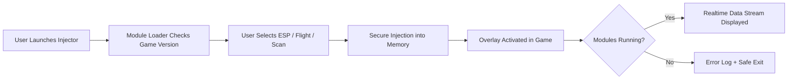

# Star Citizen Cheats Tool – Advanced Flight Assist & Resource Scanner 🌌

The **Star Citizen Cheats Tool** is an advanced enhancement suite designed to give pilots superior situational awareness and control in the vast universe of *Star Citizen*. From **ESP overlays** for tracking ships and loot to **auto-flight stabilization**, this tool empowers both traders and bounty hunters to optimize their gameplay, explore safely, and master the cosmos.

---

## ⚙️ Overview

Navigating deep space isn’t just about skill — it’s about data, precision, and reaction speed. The Star Citizen Cheats Tool brings you real-time analytics, visual radar overlays, and mining scanners to detect resources before your competitors.

Whether you're dogfighting in atmosphere or mining quantanium in the outer systems, this utility ensures smooth performance and actionable intelligence at every moment.

---

## 🌠 Key Features

### 👁 Ship & Player ESP

* Displays ship outlines, speed, distance, and faction data.
* Detects hidden entities even through fog or asteroid fields.
* Toggle visibility by category (enemy, ally, neutral).

### 🎯 Auto-Flight Assist

* Precision auto-leveling and cruise control functions.
* Adjustable responsiveness for combat or travel.
* Optional “combat-lock” for tailing enemy ships automatically.

### ⛏ Mining & Cargo Scanner

* Visual overlay for rare minerals and cargo nodes.
* Real-time yield estimation with mining mode toggle.
* Custom alerts for high-value ore (Quantanium, Laranite, Bexalite).

### 🛰 Radar Vision

* 3D radar dome with 360° detection.
* Zoom control for close or wide-range scans.
* Heat signature analysis to track cloaked vessels.

---

## 💻 Compatibility

| Component            | Supported                |
| -------------------- | ------------------------ |
| **Operating System** | Windows 10, Windows 11   |
| **Processor**        | Intel / AMD x64          |
| **Display API**      | Vulkan, DX11             |
| **Game Version**     | Latest RSI Alpha build   |
| **Anti-Cheat Mode**  | Secure sandbox injection |

> [!NOTE]
> Cloud-sync profiles allow you to switch between multiple systems without losing your config — ideal for players with multi-rig setups.

---

## ⚡️ Setup Guide

1. **Download** the Star Citizen Cheats Tool from the verified link.
2. **Extract** files to your preferred directory (avoid `Program Files`).
3. Run the **Injector.exe** while the launcher is open but before login.
4. Choose desired modules (ESP, Auto-Flight, Mining Scan).
5. Start *Star Citizen* and press `INS` to toggle the overlay.

Example configuration file:

```ini
[Overlay]
ShowESP=true
ESPDistance=3500
ShowMiningNodes=true
MiningAlert=HighValue
[FlightAssist]
AutoLevel=true
CruiseControlSensitivity=0.6
LockOnRadius=180
```

---

### 🧭 System Flow (Mermaid Diagram)



---

## ❓ FAQ

### **Q1: Is this tool detectable by RSI anti-cheat?**

**A:** The injection method uses a sandboxed kernel emulation to avoid signature flags. However, updates may affect safety — always check patch notes.

### **Q2: Can I use the ESP in FPS mode or only spaceflight?**

**A:** Both. The overlay adapts to ground missions and EVA movement seamlessly.

### **Q3: What are the system requirements?**

**A:** Minimum GTX 1060 or equivalent, 8GB RAM, SSD recommended.

### **Q4: Does it affect FPS or performance?**

**A:** With optimized rendering, average FPS drop is under 3%. You can disable mining or radar modules to further reduce load.

### **Q5: How often is the tool updated?**

**A:** Typically within 24–48 hours of each *Star Citizen* PTU or Live patch.

> [!IMPORTANT]
> Always download from the **verified mirror** to ensure integrity and avoid corrupted or spoofed builds.

---

## 🪐 Advanced Configuration Tips

* Use `F2` to toggle minimal HUD when dogfighting.
* For mining specialists, pair with low-FOV scan (45°) for pinpoint accuracy.
* Adjust opacity in `overlay.ini` for better night missions.
* Save profiles for each role (miner, trader, bounty hunter).

---

## 🧩 Community Integration

Our Discord channel includes:

* Real-time patch update alerts.
* User-made config packs.
* Custom reticle skins for HUD overlays.

---

## 🚀 Final Thoughts

The **Star Citizen Cheats Tool** is not just an overlay — it’s a modular companion for pilots who demand total command of their environment.
With automated flight correction, 3D radar, and advanced mining detection, it enhances gameplay while maintaining full immersion and control.

Explore deeper. Fly smarter. **Dominate the verse — start today.**

---
